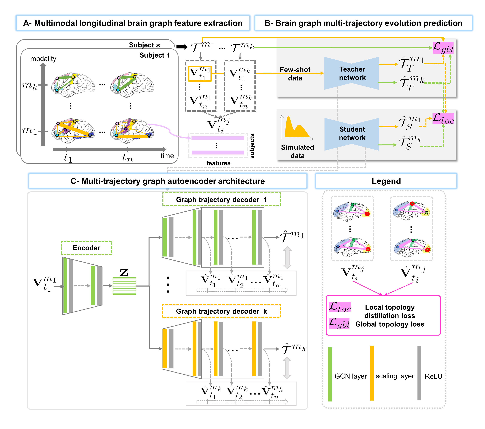

# GmTE-Net
GmTE-Net for predicting graph multi-trajectory evolution, coded up in Python by Alaa Bessadok (alaa.bessadok@gmail.com).  

This repository provides the official PyTorch implementation of the following paper:



> **A Few-shot Learning Graph Multi-Trajectory EvolutionNetwork for Forecasting Multimodal Baby ConnectivityDevelopment from a Baseline Timepoint**<br/>
> [Alaa Bessadok](https://github.com/AlaaBessadok) <sup>1,2</sup>, [Ahmed Nebli](https://github.com/ahmednebli) <sup>1</sup>, [Mohamed Ali Mahjoub]<sup>2</sup>, [Islem Rekik](https://basira-lab.com/) <sup>1</sup><br/>
> <sup>1</sup>BASIRA Lab, Faculty of Computer and Informatics, Istanbul Technical University, Istanbul, Turkey<br/>
> <sup>2</sup>Higher Institute of Informatics and Communication Technologies, University of Sousse, Tunisia<br/>
>
> **Abstract:** *Charting  the  baby  connectome  evolution  trajectory  during  the  firstyear after birth plays a vital role in understanding baby brains’ dynamic connec-tivity development. Such analysis requires the acquisition of longitudinal connec-tomic datasets. However, both neonatal and postnatal scans are rarely acquireddue to various difficulties. A small body of works has focused on predicting babybrain evolution trajectory from a neonatal brain connectome derived from a sin-gle modality. Although promising, large training datasets are essential to boostmodel learning and to generalize to a multi-trajectory prediction from differentmodalities (i.e., functional and morphological connectomes). Here, we unprece-dentedly explore the question: “Can we design a few-shot learning-based workfor predicting brain graph evolution over multimodal trajectories?”. To this aim,we  propose  a  Graph  Multi-Trajectory  Evolution  Network  (GmTE-Net),  whichadopts  a  teacher-student  paradigm  so  that  the  teacher  network  learns  on  pureneonatal brain graphs and the student network learns on simulated brain graphsgiven  a  set  of  different  time  points.  To  the  best  of  our  knowledge,  this  is  thefirst teacher-student architecture tailored for brain graph multi-trajectory growthprediction  that  is  based  on  few-shot  learning  and  generalized  to  graph  neuralnetworks (GNNs). To boost the student network’s performance, we introduce alocal topology-aware distillation loss that forces the student network’s predictedgraph topology to be consistent with the teacher network. Experimental resultsdemonstrate substantial performance gains over benchmark methods. Thereby,our model can serve as an assuring model for multimodal longitudinal brain graphprediction.*
## Dependencies
* [Python 3.8+](https://www.python.org/)
* [PyTorch 1.5.0+](http://pytorch.org/)
* [Networkx 2.5](https://networkx.org/)
* [Scikit-learn 0.23.0+](https://scikit-learn.org/stable/)
* [Numpy 1.18.1+](https://numpy.org/)

## Running GmTE-Net

We provide a demo code for the usage of GmTE-Net for predicting multi-trajectory evolution of graphs from a single graph.
In main.py we train both teacher and student networks on a simulated dataset: 4 subjects for the teacher to ensure the few-shot learning setting and 100 subjects for the student. Each sample has brain graphs denoting two modalities (i.e., a low-resolution and a super-resolution brain graphs) acquired at 4 timepoints one used as baseline to train the model and the other three timepoints represents the trajectory to predict. 
In this example, we only used one argument (i.e., mode) which describes the training or testing stage we want to use. You can add hyper-parameters (e.g., nb_timepoints, hidden2, LRout) and vary their default values.

You can train bothe teacher and student networks of our GmTE-Net framework with the following command:

```bash
python main.py --mode='train'
```

In this example, we simulated a testing set with 11 samples and 4 timepoints. If you want to test both trained networks using the default hyperparameters, type in the terminal the following commande:

```bash
python main.py --mode='test'
```

# Input and Output data

In order to use our framework, you need to provide a set of trajectories where a single trajectory represents a set of feature matrices acquired at multiple timepoints. A feature matrix is of size (n * d). We denote n the total number of subjects in the dataset and d the number of features extracted from the connectivity matrix. You need to include your data in the file main.py by removing our simulated graphs and replace it with yours. We note here that two feature matrices derived from two different trajecoties might have different number of features (i.e, a super-resolution and a low-resolution graphs). In that way, our code is generic and can be used for any type of isomorphic graph. It mainly outputs multiple trajectories with different resolution from a single graph (see figure below).

In the example below, given the brain graph at t1, GmTE-Net.py produces two trajectories each is a set of follow-up brain graphs of a specific modality. The brain connectivity matrices of one modality have a size of 35 x 35 and for the second modality they have a size of 116 x 116.

<p align="center">
  
</p>

# YouTube videos to install and run the code and understand how GmTE-Net works

To install and run GmTE-Net, check the following YouTube video:
https://youtu.be/

To learn about how GmTE-Net works, check the following YouTube video:
https://youtu.be/

# Please cite the following paper when using GmTE-Net:

```latex
@inproceedings{
}
```

# GmTE-Net on arXiv 

Link: https://arxiv.org/abs/

# License
Our code is released under MIT License (see LICENSE file for details).
